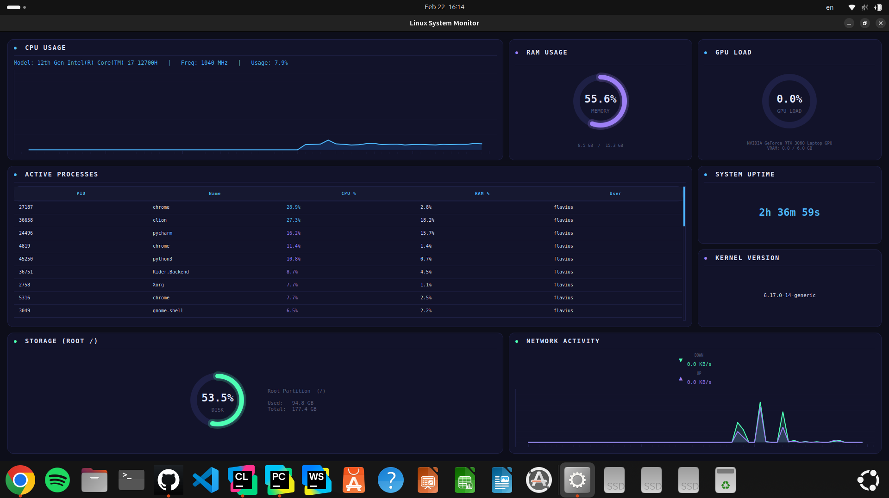

# 🖥️System Monitor

A high-performance, visually stunning system monitoring dashboard for Linux.
Built with a **blazing-fast C backend** for raw system data extraction and a **modern Python (PyQt6) frontend** for a beautiful, cyberpunk-inspired user interface.


*(Note: Replace `SM.png` with an actual screenshot of your app!)*

## ✨ Features

* **⚡ Native C Backend:** Reads system metrics directly from Linux `/proc` files and native APIs for zero-overhead monitoring.
* **📊 Live CPU & RAM Tracking:** Real-time graphs and custom-drawn circular gauges (neon style).
* **🎮 GPU Monitoring:** Live tracking of NVIDIA GPU utilization and VRAM usage.
* **🌐 Network Activity:** Real-time download (RX) and upload (TX) speeds with history graphs.
* **💽 Storage Info:** Root partition (`/`) usage gauge.
* **💀 Interactive Task Manager:** View top CPU-consuming processes and **double-click any process to kill it** instantly.
* **⏱️ System Info:** Displays live System Uptime and the current Kernel version.

## 🛠️ Tech Stack

* **Backend:** C (Compiled to a shared library `.so` via GCC / CMake)
* **Frontend:** Python 3, PyQt6, pyqtgraph
* **Bridge:** Python `ctypes` for seamless C-to-Python communication.

## 📦 Prerequisites

Before installing, ensure your Linux system has the following tools installed:
* `gcc` and `make` (for compiling the C backend)
* `python3` and `pip` (Python package manager)
* `python3-venv` (for creating a virtual environment)
* NVIDIA Drivers & `nvidia-smi` (if you want the GPU metrics to work)

## 🚀 Installation & Setup

**1. Clone the repository**
```bash
git clone https://github.com/FlaviusMarian27/System-Monitor
cd linux-system-monitor
```

**2. Compile the C Backend**
You need to compile the C files into a shared object library (`.so`) so Python can use it:
```bash
mkdir -p build
gcc -shared -o build/libmonitor.so -fPIC src/backend/*.c
```

**3. Set up the Python Virtual Environment**
```bash
python3 -m venv .venv
source .venv/bin/activate
pip install -r requirements.txt
```

## 🎮 Usage

**To run the application directly from the terminal:**
```bash
chmod +x run.sh
./run.sh
```

**To create a Desktop Shortcut (Ubuntu/Debian):**
Run the automated shortcut generator to place the app on your desktop and application menu:
```bash
chmod +x create_shortcut.sh
./create_shortcut.sh
```
*After running this, you can just double-click the "Linux System Monitor" icon on your Desktop!*

## 📂 Project Structure

```text
System-Monitor/
│
├── build/                   # Directory for the generated shared library
│   └── libmonitor.so        # The compiled C library (.so) used by Python
│
├── src/                     # Main source code directory
│   ├── backend/             # C Backend (Low-level system data extraction)
│   │   ├── include/         # Header files (.h) defining structs and functions
│   │   │   ├── core.h       # Main bridge structure sent to Python
│   │   │   ├── cpu.h        # CPU usage and frequency headers
│   │   │   ├── disk.h       # Storage headers
│   │   │   ├── gpu.h        # NVIDIA GPU headers
│   │   │   ├── memory.h     # RAM usage headers
│   │   │   ├── network.h    # Live download/upload speed headers
│   │   │   ├── processes.h  # Active processes headers
│   │   │   └── sysinfo.h    # Uptime and Kernel headers
│   │   │
│   │   ├── core.c           # Main backend file that links all modules together
│   │   ├── cpu.c            # Parses /proc/stat and /proc/cpuinfo
│   │   ├── disk.c           # Reads storage info via statvfs
│   │   ├── gpu.c            # Extracts GPU data using popen("nvidia-smi")
│   │   ├── memory.c         # Parses /proc/meminfo
│   │   ├── network.c        # Calculates live network speeds from /proc/net/dev
│   │   ├── processes.c      # Fetches top CPU processes using popen("ps")
│   │   └── sysinfo.c        # Native C calls for system uptime and kernel
│   │
│   └── frontend/            # Python Frontend (GUI and Data Visualization)
│       └── main.py          # The main PyQt6 app (contains UI, gauges, and ctypes bridge)
│
├── .venv/                   # (Auto-generated) Python Virtual Environment
├── create_shortcut.sh       # Bash script to create a trusted Desktop shortcut
├── icon.png                 # Application logo/icon
├── README.md                # Project documentation for GitHub
├── requirements.txt         # Python dependencies (PyQt6, pyqtgraph)
└── run.sh                   # Master script to compile C code and launch the app
```

## 🤝 Contributing
Feel free to fork this project, submit pull requests, or open an issue if you find a bug!

## 📜 License
This project is open-source and available under the MIT License.